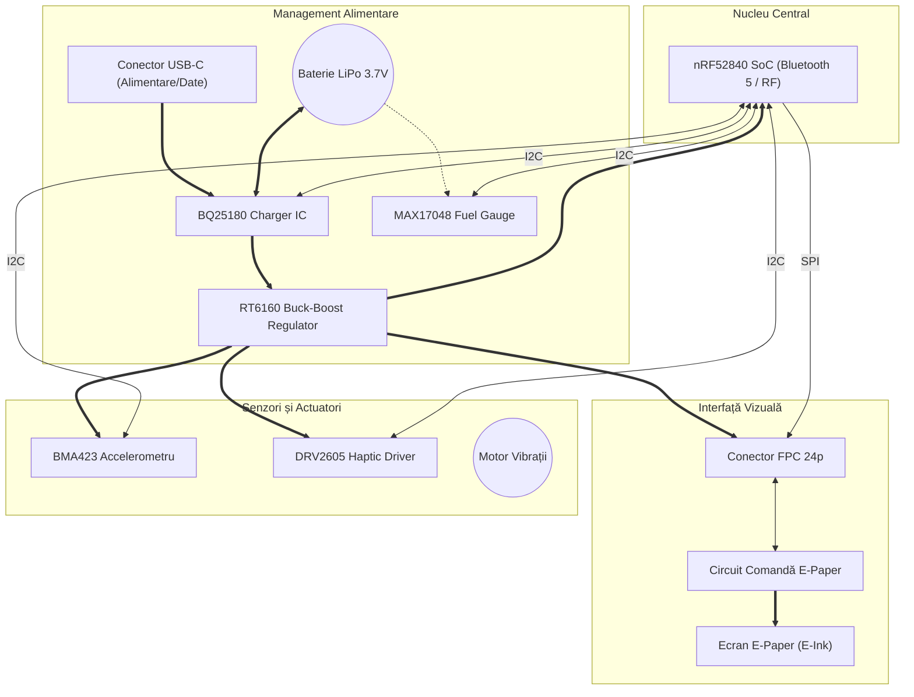

## 1. Descrierea Detaliată a Funcționalității Hardware

Sistemul este un ceas inteligent (smartwatch) cu consum ultra-redus de energie, bazat pe SoC-ul **nRF52840**, care integrează conectivitate Bluetooth Low Energy (BLE) și un afișaj de tip E-Paper (E-Ink).

### Module și Componente Cheie:
* **Unitatea Centrală (MCU):** **nRF52840** (Cortex-M4F la 64MHz). Este ales pentru suportul hardware de Floating Point (necesar procesării datelor de la senzori) și pentru managementul avansat al energiei.
* **Afișajul (E-Paper):** Spre deosebire de ecranele LCD/OLED, acesta consumă energie **doar la schimbarea imaginii**. Circuitul de control (E-Paper Drive) utilizează un convertor boost format din inductorul **L5 (68µH)** și diodele **MBR0530** pentru a genera tensiunile de ±15V necesare orientării particulelor de pigment din ecran.
* **Managementul Bateriei (Power Management):**
    * **Charger (BQ25180):** Permite încărcarea controlată prin USB și monitorizarea prin I2C.
    * **Fuel Gauge (MAX17048):** Folosește algoritmul *ModelGauge* pentru a estima procentul bateriei fără a necesita un rezistor de descărcare (shunt), economisind energie.
    * **Regulator Buck-Boost (RT6160):** Menține constantă tensiunea de 3.3V chiar și când bateria scade sub acest prag (până la 2.5V), maximizând timpul de utilizare.
* **Senzori și Feedback:**
    * **Accelerometru (BMA423):** Include funcții hardware pentru numărarea pașilor (pedometer) și detectarea gestului de "ridicare mână" (tilt-to-wake), trimițând o întrerupere către MCU pentru a-l trezi din sleep.
    * **Haptic Driver (DRV2605):** Permite generarea de efecte de vibrație complexe (peste 100 de librării incluse) pentru notificări discrete.

### Specificații de Comunicație:
* **I2C (Inter-Integrated Circuit):** Lucrează la 400kHz (Fast Mode). Conectează Charger-ul, Fuel Gauge-ul, IMU-ul și Haptic Driver-ul. Această magistrală este ideală pentru senzori datorită simplității și consumului redus.
* **SPI (Serial Peripheral Interface):** Folosit exclusiv pentru ecranul E-Paper pentru a asigura o rată de transfer a datelor suficient de mare pentru refresh-ul imaginii.

---

## 2. Diagrama bloc

## 3. Configurarea Pinilor nRF52840 (Pinout Mapping)

Alegerea pinilor pe nRF52840 este critică pentru a evita interferențele și pentru a optimiza rutarea semnalelor RF.

| Pin MCU | Funcție Schematic | Explicație și Justificare |
| :--- | :--- | :--- |
| **P0.26 / P0.27** | **SDA / SCL** | **Magistrala I2C.** Sunt pini digitali generali. S-au ales acești pini pentru a păstra magistrala de senzori grupată fizic pe PCB. |
| **P1.01** | **EPD_BUSY** | **Intrare digitală.** MCU citește acest pin pentru a ști când ecranul a terminat operațiunea de refresh (activ high). |
| **P1.02** | **EPD_RES** | **Reset ecran.** Pin digital folosit pentru inițializarea hardware a controlerului de display. |
| **P1.03** | **EPD_DC** | **Data/Command.** Semnal de control SPI care indică dacă datele trimise sunt comenzi sau pixeli. |
| **P1.04** | **EPD_CS** | **Chip Select.** Activează comunicația SPI cu ecranul. |
| **P1.05** | **EPD_SCK** | **SPI Clock.** Generat de MCU pentru sincronizarea datelor către ecran. |
| **P1.06** | **EPD_MOSI** | **Master Out Slave In.** Linia principală de date către afișaj. |
| **P0.11** | **INT_IMU** | **Intrare Întrerupere.** Conectat la pinul INT1 al BMA423. Trezește procesorul din modul System OFF la detectarea mișcării. |
| **P0.03** | **HAPTIC_EN** | **Trigger.** Activează driverul de vibrații. Poate fi folosit și cu PWM pentru intensitate variabilă. |
| **P0.02, P0.29, P0.31** | **Buttons (UP, ENT, DN)** | **Interfață Utilizator.** Configurați cu Pull-Up intern. Sunt pini capabili de "Sense" pentru a trezi dispozitivul din moduri de consum ultra-redus. |

### Calcule și Considerente de Consum:
1.  **Mod Sleep (Deep Sleep):** Cu nRF52840 în modul *System ON Idle* și senzorii în mod *Low Power*, consumul estimat este de aproximativ **15-20 µA**.
2.  **Refresh Ecran:** În timpul celor 1-2 secunde de refresh E-Paper, consumul sare la **5-10 mA** datorită convertorului boost.
3.  **Baterie:** Folosind o baterie LiPo de 100mAh, cu un management corect al sleep-ului, autonomia poate depăși **2-3 săptămâni**.

Acest design respectă rigurozitatea cerută în cadrul cursului TSC, punând accent pe utilizarea eficientă a perifericelor hardware ale nRF52840 și pe independența modulelor față de CPU prin utilizarea întreruperilor.

### 4. Bill of materials

| Cantitate | Componentă / Modul | Designator (Parts) | Descriere Scurtă | Link Achiziție / Resurse | Datasheet / Link Producător |
| :--- | :--- | :--- | :--- | :--- | :--- |
| 1 | **nRF52840** | U$1 | [cite_start]Microcontroler Bluetooth [cite: 738, 740] | [Mouser/Search](https://www.mouser.com) | [Nordic Semi](https://www.google.com/search?q=https://www.nordicsemi.com) |
| 1 | **2450AT18B100E** | ANT1 | [cite_start]Antenă Chip 2.45GHz [cite: 358, 360] | [cite_start][Arrow Link](https://www.arrow.com/en/products/2450at18b100e/johanson-dielectrics) [cite: 360] | [cite_start][Johanson Tech](https://www.google.com/search?q=https://www.mouser.co.uk/ProductDetail/Johanson-Technology/2450at18b100e) [cite: 364] |
| 1 | **BQ25180YBGR** | IC1 | [cite_start]Charger IC Li-Ion/Polymer [cite: 574, 576] | [cite_start][Mouser Link](https://www.google.com/search?q=https://www.mouser.co.uk/ProductDetail/Texas-Instruments/BQ25180YBGR) [cite: 581] | [cite_start][Texas Instruments](https://www.google.com/search?q=https://www.arrow.com/en/products/bq25180ybgr/texas-instruments) [cite: 576] |
| 1 | **RT6160AWSC** | IC2 | [cite_start]Buck-Boost Regulator [cite: 755, 757] | [cite_start][Mouser Link](https://www.google.com/search?q=https://www.mouser.co.uk/ProductDetail/Richtek/RT6160AWSC) [cite: 762] | [cite_start][Richtek](https://www.google.com/search?q=https://www.mouser.co.uk/ProductDetail/Richtek/RT6160AWSC) [cite: 762] |
| 1 | **BMA423** | IC3 | [cite_start]Accelerometru 3 axe [cite: 559, 561] | [cite_start][Mouser Link](https://www.google.com/search?q=https://www.mouser.co.uk/ProductDetail/Bosch-Sensortec/BMA423) [cite: 566] | [cite_start][Bosch Sensortec](https://www.arrow.com/en/products/bma423/bosch) [cite: 562] |
| 1 | **DRV2605YZFR** | IC4 | [cite_start]Haptic Driver (ERM/LRA) [cite: 604, 606] | [cite_start][Arrow Link](https://www.arrow.com/en/products/drv2605yzfr/texas-instruments) [cite: 606] | [cite_start][Texas Instruments](https://www.arrow.com/en/products/drv2605yzfr/texas-instruments) [cite: 606] |
| 1 | **FTC252012SR47MBCA** | L1 | [cite_start]Inductor 0.47µH [cite: 706, 707] | [cite_start][**JLC Parts (C5832368)**](https://jlcpcb.com/partdetail/6763488-FTC252012SR47MBCA/C5832368) [cite: 712] | [cite_start][TDK](https://jlcpcb.com/partdetail/6763488-FTC252012SR47MBCA/C5832368) [cite: 712] |
| 1 | **KH-TYPE-C-16P** | J2 | [cite_start]Conector USB-C 16 pini [cite: 691, 692] | [cite_start][SnapEDA Link](https://www.snapeda.com/parts/KH-TYPE-C-16P/Kinghelm/view-part/?ref=snap) [cite: 703] | [cite_start][Kinghelm](https://www.snapeda.com/parts/KH-TYPE-C-16P/Kinghelm/view-part/?ref=eda) [cite: 694] |
| 1 | **503480-2400** | J1 | [cite_start]Conector FPC 24 pini [cite: 493, 494] | [cite_start][Mouser Link](https://www.google.com/search?q=https://www.mouser.co.uk/ProductDetail/Molex/503480-2400) [cite: 500] | [cite_start][Molex](https://www.google.com/search?q=https://www.mouser.co.uk/ProductDetail/Molex/503480-2400) [cite: 500] |
| 3 | **MBR0530** | D1, D2, D3 | [cite_start]Diodă Schottky 0.5A 30V [cite: 632, 634] | [cite_start][SnapEDA Link](https://www.snapeda.com/parts/MBR0530/Onsemi/view-part/?ref=snap) [cite: 642] | [cite_start][ON Semi](https://www.snapeda.com/parts/MBR0530/Onsemi/view-part/?ref=eda) [cite: 636] |
| 1 | **USBLC6-2SC6Y** | D4 | [cite_start]Protecție ESD SOT-23-6 [cite: 619, 621] | [cite_start][SnapEDA Link](https://www.snapeda.com/parts/USBLC6-2SC6Y/STMicroelectronics/view-part/?ref=snap) [cite: 629] | [cite_start][STMicro](https://www.snapeda.com/parts/USBLC6-2SC6Y/STMicroelectronics/view-part/?ref=eda) [cite: 622] |
| 1 | **SI1308EDL-T1-GE3** | Q1 | [cite_start]MOSFET N-Ch 30V 1.5A [cite: 646, 647] | [cite_start][SnapEDA Link](https://www.snapeda.com/parts/SI1308EDL-T1-GE3/Vishay+Siliconix/view-part/?ref=snap) [cite: 656] | [cite_start][Vishay](https://www.snapeda.com/parts/SI1308EDL-T1-GE3/Vishay+Siliconix/view-part/?ref=eda) [cite: 648] |
| 3 | **EVP-AKE31A** | SW1-SW3 | [cite_start]Întrerupător (Switch) [cite: 326, 327] | [Panasonic Search](https://www.mouser.com) | [Panasonic](https://www.mouser.com) |
| 1 | **TC2030-IDC** | J3 | [cite_start]Adaptor programare 6 pini [cite: 770, 771] | [Tag-Connect](https://www.tag-connect.com) | [cite_start][Tag-Connect](https://www.tag-connect.com) [cite: 776] |

